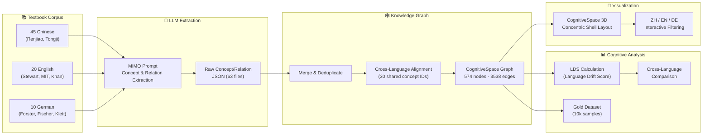

# 🧠 LinguaGraph — Mapping How Language Shapes Thinking

> **BWKI 2026 (Bundeswettbewerb Künstliche Intelligenz)**
> *How does language shape the way we think? — Measured with AI and graph theory.*
> *Wie beeinflusst Sprache unser Denken? — Gemessen mit KI und Graphentheorie.*
>
> A cognitive graph + multilingual reasoning dataset system.  
> **Focus**: structured concept extraction, cross-language knowledge graph alignment, and LDS-based cognitive analysis across ZH/EN/DE.

<p align="center">
  <a href="https://github.com/jjjjjjjjnnjnn/BWKI-2026-LinguaGraph/stargazers">
    
  </a>
  <a href="https://github.com/jjjjjjjjnnjnn/BWKI-2026-LinguaGraph/blob/master/LICENSE">
    
  </a>
  <a href="https://github.com/jjjjjjjjnnjnn/BWKI-2026-LinguaGraph/commits/master">
    
  </a>
  <a href="https://github.com/jjjjjjjjnnjnn/BWKI-2026-LinguaGraph">
    
  </a>
  
  
  
  <a href="https://github.com/jjjjjjjjnnjnn/BWKI-2026-LinguaGraph/discussions">
    
  </a>
</p>

<p align="center">
  
  <br>
  <em>CognitiveSpace — 3D knowledge graph of mathematics across 4 education levels (elementary → university) in ZH/EN/DE. 574 concepts, 3538 relations, 68 textbooks.</em>
</p>

---

## Research Pipeline



---

| 🇨🇳 [中文](#-中文) | 🇬🇧 [English](#-english) | 🇩🇪 [Deutsch](#-deutsch) |
|:---|:---|:---|
| [简介](#简介) | [Introduction](#introduction) | [Einleitung](#einleitung) |
| [核心创新](#核心创新) | [Key Innovation](#key-innovation) | [Kerninnovation](#kerninnovation) |
| [研究框架](#研究框架) | [Pipeline](#pipeline) | [Pipeline](#pipeline-1) |
| [技术栈](#技术栈) | [Tech Stack](#tech-stack) | [Technologie-Stack](#technologie-stack) |
| [实验设计](#实验设计) | [Experiment Design](#experiment-design) | [Versuchsdesign](#versuchsdesign) |
| [合规与伦理](#合规与伦理) | [Ethics & Compliance](#ethics--compliance) | [Ethik & Datenschutz](#ethik--datenschutz) |
| [项目结构](#项目结构) | [Project Structure](#project-structure) | [Projektstruktur](#projektstruktur) |
| [快速开始](#快速开始) | [Quick Start](#quick-start) | [Schnellstart](#schnellstart) |
| [项目状态](#项目状态) | [Project Status](#project-status-1) | [Projektstatus](#projektstatus) |

**Common sections:** [Citation](#-引用--citation--zitation) · [Copyright](#-版权声明--copyright--urheberrecht)

---

## 🇨🇳 中文

### 简介

**LinguaGraph** 是一个跨学科研究项目，旨在通过人工智能与图论方法，量化回答**"语言是否改变人的思维方式？"**这一经典语言学问题。

### 核心创新

| 创新点 | 说明 |
|--------|------|
| **LDS (Language Drift Score)** | 首个在图结构层面量化跨语言认知差异的指标 |
| **CognitiveSpace** | 3D 知识图谱可视化：574 概念 × 4 学段 × 3 语言 |
| **三语比较** | 中文、德语、英语三种语言系统的认知图谱分析 |

### 研究框架

```text
学生回答 (ZH/DE/EN)
    ↓
LLM 提取概念与关系
    ↓
构建认知图谱 (NetworkX DiGraph)
    ↓
跨语言概念对齐 (30个共享概念ID)
    ↓
计算 LDS / LCD / 概念Shift
    ↓
3D CognitiveSpace 可视化
```

### 技术栈

- **AI**: OpenAI GPT-4.1-mini / Qwen3-8B / Ollama (插件式 Provider)
- **图论**: NetworkX, Graph Edit Distance, Jaccard 相似度
- **数据库**: SQLite (10 张表)
- **可视化**: 3d-force-graph (CognitiveSpace)
- **数据**: 300 条计算基线 + Wikipedia 多语语料
- **技术复用**: 核心组件（Provider 抽象、GGUF 量化、LoRA 适配）已抽离为独立运行时 [MML Runtime](#)，同时服务认知提取与游戏叙事等不同场景

### 实验设计

- **30 名参与者** (10 ZH, 10 DE, 10 EN)
- **5 主题 × 3 语言** = 15 道开放式问题
- **组内 + 组间混合设计**
- **统计功效**: 效应量 d=0.6-0.8, α=0.05, power>0.80

### 合规与伦理

- ✅ GDPR 合规 (Art. 6, 7, 8, 13, 15, 16, 17, 33, 34, 77)
- ✅ 三语知情同意书 (ZH/DE/EN)
- ✅ 未成年人参与保护机制
- ✅ 数据匿名化处理

---

## 🇬🇧 English

### Introduction

**LinguaGraph** is an interdisciplinary research project that uses AI and graph theory to quantify whether **language shapes the structure of human thought** — the classic Sapir-Whorf hypothesis of linguistic relativity.

### Key Innovation

| Innovation | Description |
|-----------|-------------|
| **LDS (Language Drift Score)** | First metric quantifying cross-lingual cognitive differences at the graph-structure level |
| **CognitiveSpace** | 3D knowledge graph: 574 concepts × 4 levels × 3 languages |
| **Trilingual Comparison** | Chinese, German, and English cognitive graph analysis |

### Pipeline

```text
Participant responses (ZH/DE/EN)
    ↓
LLM concept & relation extraction
    ↓
Cognitive graph construction (NetworkX DiGraph)
    ↓
Cross-language concept alignment (30 shared concept IDs)
    ↓
LDS / LCD / Concept Shift computation
    ↓
3D CognitiveSpace visualization
```

### Tech Stack

- **AI**: OpenAI GPT-4.1-mini / Qwen3-8B / Ollama (pluggable Provider system)
- **Graph**: NetworkX, Graph Edit Distance, Jaccard similarity
- **Database**: SQLite (10 tables)
- **Visualization**: 3d-force-graph (CognitiveSpace)
- **Data**: 300 computational baselines + multilingual Wikipedia corpus
- **Tech reusability**: Core components (Provider abstraction, GGUF quantization, LoRA adapters) extracted as a standalone [MML Runtime](#), serving both cognitive extraction and game narrative scenarios

### Experiment Design

- **30 participants** (10 ZH, 10 DE, 10 EN)
- **5 topics × 3 languages** = 15 open-ended questions
- **Mixed within-subject + between-subject design**
- **Power analysis**: d=0.6-0.8, α=0.05, power>0.80

### Ethics & Compliance

- ✅ GDPR compliant (Art. 6, 7, 8, 13, 15, 16, 17, 33, 34, 77)
- ✅ Trilingual consent forms (ZH/DE/EN)
- ✅ Minor participant protection
- ✅ Full data anonymization

---

## 🇩🇪 Deutsch

### Einleitung

**LinguaGraph** ist ein interdisziplinäres Forschungsprojekt, das mithilfe von KI und Graphentheorie quantifiziert, ob **Sprache die Struktur des menschlichen Denkens prägt** — die klassische Sapir-Whorf-Hypothese der linguistischen Relativität.

### Kerninnovation

| Innovation | Beschreibung |
|-----------|-------------|
| **LDS (Language Drift Score)** | Erster Metrik zur Quantifizierung cross-lingualer kognitiver Unterschiede auf Graphenebene |
| **CognitiveSpace** | 3D-Visualisierung: 574 Konzepte × 4 Stufen × 3 Sprachen |
| **Dreisprachiger Vergleich** | Kognitive Graphenanalyse für Chinesisch, Deutsch und Englisch |

### Pipeline

```text
Teilnehmerantworten (ZH/DE/EN)
    ↓
LLM-Konzept- und Relationsextraktion
    ↓
Aufbau kognitiver Graphen (NetworkX DiGraph)
    ↓
Sprachübergreifende Konzeptzuordnung (30 geteilte Konzept-IDs)
    ↓
LDS / LCD / Concept-Shift-Berechnung
    ↓
3D CognitiveSpace Visualisierung
```

### Technologie-Stack

- **KI**: OpenAI GPT-4.1-mini / Qwen3-8B / Ollama (Plugin-basiertes Provider-System)
- **Graphentheorie**: NetworkX, Graph Edit Distance, Jaccard-Ähnlichkeit
- **Datenbank**: SQLite (10 Tabellen)
- **Visualisierung**: 3d-force-graph (CognitiveSpace)
- **Daten**: 300 Rechen-Baselines + mehrsprachiges Wikipedia-Korpus
- **Wiederverwendbarkeit**: Kernkomponenten (Provider-Abstraktion, GGUF-Quantisierung, LoRA-Adapter) als eigenständige [MML Runtime](#) extrahiert, die sowohl kognitive Extraktion als auch Spielerzählung bedient

### Versuchsdesign

- **30 Teilnehmer** (10 ZH, 10 DE, 10 EN)
- **5 Themen × 3 Sprachen** = 15 offene Fragen
- **Gemischtes Within-Subject + Between-Subject Design**
- **Power-Analyse**: Effektstärke d=0.6-0.8, α=0.05, Power>0.80

### Ethik & Datenschutz

- ✅ DSGVO-konform (Art. 6, 7, 8, 13, 15, 16, 17, 33, 34, 77)
- ✅ Dreisprachige Einwilligungserklärungen (ZH/DE/EN)
- ✅ Minderjährigenschutz
- ✅ Vollständige Datenanonymisierung

---

## 📂 项目结构 / Project Structure / Projektstruktur

```text
BWKI-2026-LinguaGraph/
├── src/                  # Core library / 核心库 / Kernbibliothek
│   ├── extract.py        #   Concept extraction (LLM + mock) / 概念提取
│   ├── graph.py          #   Cognitive graph construction (NetworkX)
│   ├── scoring.py        #   LDS / LCD computation
│   ├── compare.py        #   Missing link detection / 缺失链接检测
│   ├── cross_language.py #   Cross-language concept alignment
│   ├── explain.py        #   Result explanation generation
│   ├── providers/        #   LLM Provider plugin system
│   └── main.py           #   End-to-end pipeline entry
├── scripts/              # Utility scripts / 工具脚本 / Skripte
│   ├── run_pipeline.py   #   Unified pipeline (single command) / 统一管道
│   ├── pilot_pipeline.py #   Pilot data analysis / Pilot-Datenanalyse
│   ├── db_init.py        #   Database initialization / 数据库初始化
│   ├── import_pilot_data.py # Pilot data import / Pilot-Datenimport
│   ├── analyze_pilot.py  #   Pilot analysis / Pilot-Analyse
│   ├── survey_entry.py   #   Data entry CLI / 数据录入
│   └── simulate_baseline.py # Baseline simulation / 基线模拟
├── participant_data/     # Human participant data / 人类数据 / Teilnehmerdaten
│   ├── participant_manager.py # GDPR-compliant CRUD
│   ├── pilot_data.py     #   Pilot data query module
│   └── pilot_v1/         #   Frozen snapshot / 冻结快照 / eingefrorener Snapshot
├── config/               # Configuration / 配置 / Konfiguration
│   ├── concept_taxonomy.json  # 30-concept taxonomy (ZH/DE/EN)
│   ├── concept_mapping.json   # Cross-language mapping / 跨语言映射
│   └── prompts/          #   LLM prompt templates
├── data/                 # Data / 数据 / Daten
│   ├── corpus/           #   Wikipedia corpus (ZH/DE/EN)
│   ├── gold/             #   Gold-standard annotations / 人工标注
│   └── questionnaires/   #   Questionnaire definitions
├── docs/                 # Documentation / 文档 / Dokumentation
│   ├── ethics/           #   GDPR package, consent forms
│   ├── paper_results_skeleton.md # Full paper skeleton
│   ├── methodology.md    #   LDS mathematical definition
│   ├── experiment-design.md # Experiment design / 实验设计
│   └── technology_transfer.md # MML Runtime & cross-project reuse / 技术资产复用
├── outputs/              # Generated outputs / 生成结果 / Ergebnisse
│   ├── figures/          #   Publication figures (PNG)
│   ├── tables/           #   Demographic & LDS tables
│   ├── export_pipeline.py #  Publication-ready tables & figures
│   └── paper_results_template.md
├── cognitive-space/     # CognitiveSpace 3D知识图谱可视化
├── _archive/             # Deprecated visualization versions (kept for history)
├── tests/                # Test suite / 测试套件 / Tests
├── references/           # Academic references / 参考文献 (88+ papers)
├── evaluation/           # Extraction benchmark / 提取基准测试
├── survey_pipeline/      # Survey processing pipeline
├── CITATION.cff          # Citation metadata
└── LICENSE               # All Rights Reserved
```

---

## 🚀 快速开始 / Quick Start / Schnellstart

### One-Command Pipeline / 一键分析 / Ein-Befehl-Pipeline

```bash
# Full pipeline (auto-detect data state) / 全量运行（自动检测数据状态）
python scripts/run_pipeline.py

# View database status only / 仅查看数据库状态
python scripts/run_pipeline.py --status

# Force full mode (tables + figures) / 强制全量模式
python scripts/run_pipeline.py --force
```

**Outputs / 输出 / Ausgabe:** participant summary, quality report, LDS tables, publication figures.

### Manual Setup / 手动安装 / Manuelle Einrichtung

```bash
# 1. Check Python version (requires 3.10+) / 确认 Python 版本
python --version

# 2. Create virtual environment (recommended) / 创建虚拟环境
python -m venv venv
source venv/bin/activate  # Linux/Mac
# venv\Scripts\activate   # Windows

# 3. Install dependencies / 安装依赖 / Abhängigkeiten installieren
pip install -r requirements.txt

# 4. Initialize database / 初始化数据库 / Datenbank initialisieren
python scripts/db_init.py

# 5. Import existing data / 导入已有数据 / Daten importieren
python scripts/ingest_all.py

# 6. Run tests / 运行测试 / Tests ausführen
python -m pytest tests/ -v
```

> **API Key:** Default mode uses `mock` — no API key required. For real LLM extraction:
> ```bash
> export OPENAI_API_KEY="sk-..."    # Linux/Mac
> set OPENAI_API_KEY="sk-..."       # Windows CMD
> ```

### Visualization / 可视化 / Visualisierung

**🌐 Live Demo:** [jjjjjjjjnnjnn.github.io/BWKI-2026-LinguaGraph](https://jjjjjjjjnnjnn.github.io/BWKI-2026-LinguaGraph/)
*(Open `cognitive-space/web/index.html` in browser · CognitiveSpace)*

```bash
# Or run locally / 本地打开 / lokal öffnen
open cognitive-space/web/index.html    # Mac
start cognitive-space/web/index.html   # Windows
```

---

## 📊 项目状态 / Project Status / Projektstatus

| Module / 模块 / Modul | Completion / 完成度 | Status |
|:---------------------|:-------------------:|:------:|
| Core Pipeline / 核心管道 | 90% | ✅ |
| LDS Metric / LDS 指标 | 90% | ✅ |
| Visualization / 可视化 | 75% | 🟡 |
| Questionnaire / 问卷 | 95% | ✅ |
| Ethics / 伦理合规 / Ethik | 100% | ✅ |
| Version Control / 版本控制 | 100% | ✅ |
| Human Data / 人类数据 / Menschliche Daten | 5% | 🔴 |

---

## 📖 引用 / Citation / Zitation

```bibtex
@software{linguagraph2026,
  title = {LinguaGraph: Mapping How Language Shapes Thinking},
  author = {Rong, Jiajun},
  year = {2026},
  url = {https://github.com/jjjjjjjjnnjnn/BWKI-2026-LinguaGraph}
}
```

Siehe auch [`CITATION.cff`](CITATION.cff) · 或查看 CITATION.cff

---

## 🧩 系统工程验证 / System Engineering / Systemtechnik

**CognitiveSpace** — 全流程数学知识图谱（从小学到高数）

- **405 concepts, 324 relations, 0 conflicts**
- 60 textbooks across Chinese, English, German
- 3D interactive visualization: [`cognitive-space/`](cognitive-space/)
- 见论文 / See paper Appendix A

---

## © 版权声明 / Copyright / Urheberrecht

© 2026 Jiajun Rong. Alle Rechte vorbehalten. All rights reserved.

| 语言 | 声明 |
|:----|:------|
| 🇨🇳 | 本项目代码及相关文档仅供 **BWKI 2026 竞赛评审** 及 **学术研究** 目的公开查看。**未经作者书面许可，禁止任何商业用途的复制、分发或修改。** |
| 🇬🇧 | This repository is publicly accessible for **BWKI 2026 competition review** and **academic research** purposes only. No commercial use, reproduction, or modification without written permission. |
| 🇩🇪 | Dieses Repository ist ausschließlich für die **BWKI 2026 Wettbewerbsbewertung** und **akademische Forschung** öffentlich zugänglich. Keine kommerzielle Nutzung, Vervielfältigung oder Änderung ohne schriftliche Genehmigung. |

---

**BWKI 2026 · Bundeswettbewerb Künstliche Intelligenz**
