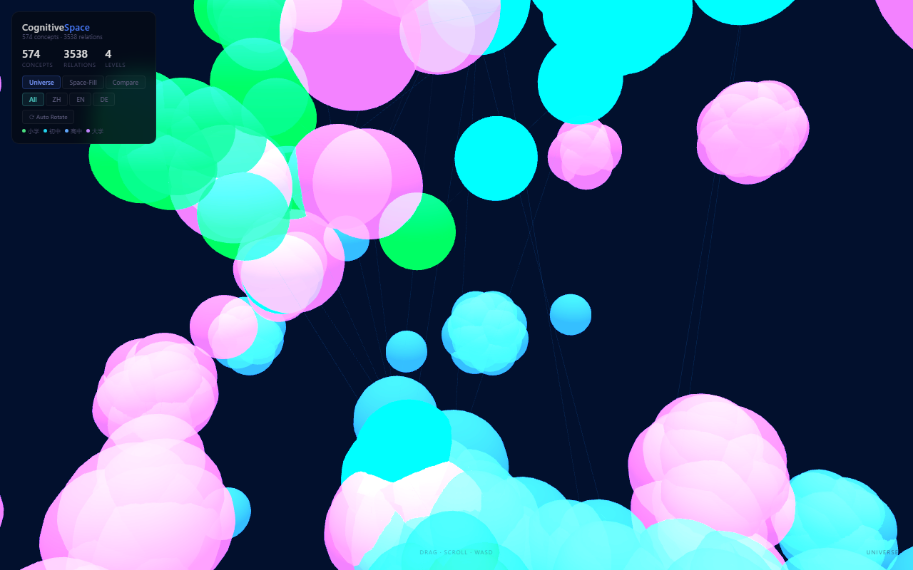

<p align="center">
  <a href="README.md">🇬🇧 English</a> · <a href="README_DE.md">🇩🇪 Deutsch</a> · <a href="README_ZH.md">🇨🇳 中文</a>
</p>

---

<p align="center">
  
</p>

<h1 align="center">🧠 LinguaGraph</h1>

<p align="center">
  <b>How do different languages and educational systems organize the same knowledge?</b>
</p>

<p align="center">
  <a href="https://github.com/jjjjjjjjnnjnn/BWKI-2026-LinguaGraph/stargazers">
    
  </a>
  <a href="https://github.com/jjjjjjjjnnjnn/BWKI-2026-LinguaGraph/blob/master/LICENSE">
    
  </a>
  <a href="https://github.com/jjjjjjjjnnjnn/BWKI-2026-LinguaGraph/commits/master">
    
  </a>
  
  
  
  
  
  
  
</p>

<p align="center">
  🇩🇪 <a href="README_DE.md">Deutsche Version</a> &nbsp;·&nbsp; 🇨🇳 <a href="README_ZH.md">中文版本</a>
</p>

---

## 📑 Table of Contents

<details>
<summary><b>Click to expand / collapse</b></summary>

- [🔥 Why LinguaGraph?](#-why-linguagraph)
- [📐 Metrics at a Glance](#-metrics-at-a-glance)
- [🏆 10 Findings (F1–F10)](#-10-findings-f1f10)
- [📊 Dataset](#-dataset)
- [✅ Extraction Validation](#-extraction-validation)
- [🚀 Quick Start](#-quick-start)
- [🧪 Model Benchmark](#-model-benchmark)
- [📁 Project Structure](#-project-structure)
- [📚 Key References](#-key-references)
- [📜 Citation](#-citation)
- [📜 License & Compliance](#-license--compliance)
- [🤝 Contact](#-contact)

</details>

---

## 🔥 Why LinguaGraph?

Mathematical truth is universal, but the way it is organized in textbooks varies dramatically across languages and educational systems. Existing curriculum analysis tools are qualitative, manual, and cannot scale across multiple languages or disciplines.

**LinguaGraph is the first automated framework that:**

- 🧩 Constructs **multilingual knowledge graphs** from textbooks at scale (1,160+ concepts, 3 languages)
- 📏 Quantifies **structural differences** between languages, education systems, and disciplines
- 🎯 Measures **textbook-curriculum alignment** across 4 educational systems (Germany, UK, US, China)
- ✅ Validates extraction quality with **92 gold-standard annotations** (F1 = 0.939)

> **It turns the invisible structure of knowledge into visible, measurable metrics.**

---

## 📐 Metrics at a Glance

| Metric | Full Name | Formula | What It Reveals |
|--------|-----------|---------|-----------------|
| **CDS** | Concept Density Score | 2\|E\|/(\|V\|·(\|V\|−1)) | Knowledge interconnection density per education level |
| **HDS** | Hierarchy Depth Score | BFS on prerequisite graph | Maximum prerequisite chain length |
| **LDS** | Language Drift Score | 1 − mean(GED, Jaccard_node, Jaccard_edge) | Cross-language structural divergence |
| **CS** | Coverage Score | \|V_textbook ∩ V_curriculum\| / \|V_curriculum\| | Textbook-curriculum alignment |

---

## 🏆 10 Findings (F1–F10)

| # | Finding | Evidence | Impact |
|---|---------|----------|--------|
| **F1** | CDS peaks at **Middle school** (0.271), not Elementary | Confirmed independently in ZH, EN, DE | Challenges "knowledge gets denser with level" assumption |
| **F2** | **3.7× density drop** from Middle to High school | 0.271 → 0.073; concept count 4.2× | Curriculum diversification after integration hub |
| **F3** | HDS ≤ **8** (mean 0.40); 83% of concepts are roots | BFS on 3,538 prerequisite relations | Mathematics is a shallow web, not a deep tree |
| **F4** | **ZH–DE** divergence highest (LDS=0.907), ZH–EN lowest (0.802) | Wikipedia corpus, 5 social topics | Counterintuitive: European languages not structurally closer |
| **F5** | LDS is **topic-dependent** | ~0.2 variation within pairs | Cross-language divergence varies by knowledge domain |
| **F6** | **Physics** peaks at **Elementary** (0.222), Math at Middle (0.271) | 366 physics concepts, 3 languages | Both follow "integrate-early, diverge-late" pattern |
| **F7** | Physics has **2.1× deeper** prerequisite chains | HDS mean 0.85 vs 0.40 | Physics knowledge is more cumulative and sequential |
| **F8** | **Chemistry** peaks at Middle (0.042), 6.5× lower than Math | 220 chemistry concepts | STEM density pattern is universal across subjects |
| **F9** | **Coverage Score** varies dramatically across systems | NRW 34%, UK 82%, US 76%, China 8% | Educational system design fundamentally affects textbook alignment |
| **F10** | Coverage trajectories reveal **system design philosophy** | UK ↑ 53→90% (exam-driven); NRW ↘ 50→31% (specialization) | Assessment structure shapes curriculum-textbook relationship |

---

## 📊 Dataset

| Subject | Concepts | Relations | Textbooks | Languages | Curriculum Coverage |
|---------|:--------:|:---------:|:---------:|:---------:|:------------------:|
| **Mathematics** | 574 | 3,538 | 68 | ZH/EN/DE | NRW 34% · UK 82% · US 76% |
| **Physics** | 366 | 383 | 94 editions | ZH/EN/DE | NRW 38% |
| **Chemistry** | 220 | 215 | 18 editions | ZH/EN/DE | NRW 36% |
| **Total** | **1,160+** | **4,100+** | **180+** | **3 languages** | **4 educational systems** |

---

## ✅ Extraction Validation

**92 gold-standard annotations** across 2 domains and 3 languages (qwen-plus, Bailian API):

| Domain | ZH F1 | DE F1 | EN F1 | Overall | n |
|--------|:-----:|:-----:|:-----:|:-------:|:-:|
| **Social concepts** | **0.974** | **0.949** | **0.882** | **0.939** | 72 |
| **Mathematics** | 0.857 | 0.506 | 0.711 | 0.674 | 20 |
| **All** | **0.974** | **0.949** | **0.882** | **0.939** | **92** |

> Error analysis: 29% of errors are from very short responses (1-2 words); 40% from partial omissions. No systematic misdirection.
> See [`docs/paper/02_methodology.md`](docs/paper/02_methodology.md) for full methodology and [`scripts/evaluate_gold.py`](scripts/evaluate_gold.py) for reproducible evaluation.

---

## 🚀 Quick Start

```bash
# 1. Install & configure
git clone https://github.com/jjjjjjjjnnjnn/BWKI-2026-LinguaGraph.git
cd BWKI-2026-LinguaGraph
pip install openai numpy
export BAILIAN_API_KEY="your-api-key"

# 2. Validate extraction quality (5 min)
python scripts/batch_process_responses.py --gold-only
python scripts/evaluate_gold.py

# 3. Generate 300-response simulation baseline
python scripts/simulate_baseline.py --mock

# 4. Full analysis pipeline
python scripts/extract_all_via_api.py
python scripts/compute_lds_from_db.py
```

### Test any model
```bash
python scripts/batch_process_responses.py --model qwen-plus --gold-only
python scripts/batch_process_responses.py --model glm-4.6 --gold-only
```

---

## 🧪 Model Benchmark

20 models tested on identical 20 gold labels (20 social + 20 math) via [Alibaba Cloud Bailian](https://bailian.console.aliyun.com/):

| Model | Domain | ZH F1 | DE F1 | EN F1 | Speed |
|-------|--------|:-----:|:-----:|:-----:|:-----:|
| **qwen-plus** | **Social** | **0.974** | **0.949** | **0.882** | 2-3s |
| qwen-turbo | Math | 0.714 | 0.448 | 0.810 | 1s |
| qwen3.7-max | Math | 0.980 | 0.551 | 0.778 | 2-3s |
| glm-4.6 | Math | 0.951 | 0.595 | 0.689 | 10-20s |

Full results: [`research/findings/bailian_benchmark_complete.json`](research/findings/bailian_benchmark_complete.json)

---

## 📁 Project Structure

```
├── scripts/              # Analysis pipelines (batch extraction, evaluation, benchmark)
├── docs/
│   ├── paper/            # Full research paper (abstract → conclusion)
│   ├── review/           # Quality audits & critical assessments
│   ├── ethics/           # GDPR compliance & consent forms
│   └── creative_submission.md  # BWKI competition submission
├── config/
│   ├── expert_graphs/    # Knowledge graphs (JSON) — Math, Physics, Chemistry, Curricula
│   └── concept_mapping.json    # 174 cross-lingual concept alignments
├── cognitive-space/      # 3D knowledge graph visualization (Three.js)
├── research/findings/    # Benchmark outputs, evaluation reports
└── .gitignore            # API keys, DB, PII excluded
```

---

## 📚 References

### Academic Papers

| # | Reference | Relevance |
|---|-----------|-----------|
| 1 | **Novak, J. D. & Cañas, A. J.** (2008). *The theory underlying concept maps and how to construct and use them.* | Foundational — concept mapping theory underpinning CDS/HDS |
| 2 | **Ausubel, D. P.** (1963). *The psychology of meaningful verbal learning.* Grune & Stratton. | Assimilation theory — knowledge is structured, not listed |
| 3 | **Schmidt, W. H. et al.** (2001). *Why schools matter: A cross-national comparison of curriculum and learning.* Jossey-Bass. | TIMSS curriculum coherence — Coverage Score inspiration |
| 4 | **Liang, L. L. & Heckmann, K.** (2013). *Comparing German and Chinese mathematics textbooks.* ZDM, 45(6). | Cross-national textbook comparison methodology |
| 5 | **Boroditsky, L.** (2001). *Does language shape thought?: Mandarin and English speakers' conceptions of time.* Cognitive Psychology, 43(1). | Linguistic relativity — research question context |
| 6 | **Siew, C. S. Q.** (2019). *Applications of network science to education research.* In: Network Science in Education. Springer. | Network analysis of cognitive/educational structures |
| 7 | **Ain, Q. T., Chatti, M. A., & Qussa, H.** (2025). *An optimized pipeline for automatic educational knowledge graph construction.* arXiv. | Most directly relevant EKG pipeline methodology |
| 8 | **Alatrash, R., Chatti, M. A., & Wibowo, A.** (2025). *Inferring prerequisite knowledge concepts in educational knowledge graphs.* arXiv. | Prerequisite inference — supports HDS metric |
| 9 | **Fan, L., Zhu, Y., & Miao, Z.** (2013). *Textbook research in mathematics education.* ESM. | Cross-national textbook problem analysis |
| 10 | **OECD.** (2023). *Education at a Glance 2023.* OECD Publishing. | Cross-national curriculum structure data |
| 11 | **IEA.** (2019). *TIMSS 2019 International Results in Mathematics and Science.* | Curriculum coverage analysis methodology |
| 12 | **Vaswani, A. et al.** (2017). *Attention Is All You Need.* NeurIPS. | Transformer architecture — foundational for LLMs used |

### Open Source Libraries

| Library | Usage | License |
|---------|-------|---------|
| [openai/openai-python](https://github.com/openai/openai-python) | LLM API client for concept extraction | MIT |
| [networkx/networkx](https://github.com/networkx/networkx) | Graph construction and analysis (CDS, HDS) | BSD-3 |
| [matplotlib/matplotlib](https://github.com/matplotlib/matplotlib) | Figure generation (Fig 3-7) | PSF |
| [numpy/numpy](https://github.com/numpy/numpy) | Numerical computation, similarity metrics | BSD-3 |
| [scipy/scipy](https://github.com/scipy/scipy) | Statistical analysis, correlation tests | BSD-3 |
| [scikit-learn/scikit-learn](https://github.com/scikit-learn/scikit-learn) | Baseline models and evaluation | BSD-3 |
| [Three.js](https://github.com/mrdoob/three.js) | 3D knowledge graph visualization (CognitiveSpace) | MIT |
| [Flask](https://github.com/pallets/flask) | Workbench web application | BSD-3 |
| [seaborn/seaborn](https://github.com/mwaskom/seaborn) | Statistical data visualization | BSD-3 |

### Curriculum Standards (Primary Sources)

| Standard | Publisher |
|----------|-----------|
| Kernlehrplan Mathematik/Physik/Chemie NRW (Sek I 2019, Sek II 2023) | MSB NRW |
| UK National Curriculum (Mathematics, Science) | DfE England |
| US Next Generation Science Standards (NGSS) | NGSS Lead States |
| Chinese National Curriculum Standards (数学/物理/化学) | MoE China |

### Textbook Corpora

Textbook content used for knowledge graph construction (academic research, fair use). Full attribution in graph metadata files.

**ZH** (33+ publishers): 人教版, 沪科版, 北师大版, 苏科版, 粤教版, 鲁科版, 马文蔚, 程守洙, 漆安慎, 赵凯华, 汪志诚, 杨福家, 梁昆淼, 郭硕鸿, 曾谨言

**EN** (34+ publishers): Khan Academy, CK-12, AP Physics, IB, IGCSE, GCSE, Halliday Resnick Walker, Serway Jewett, Young Freedman, Griffiths, Kittel, Feynman Lectures, Stewart Calculus, Strang Linear Algebra

**DE** (27+ publishers): Duden, Lambacher Schwere, Westermann, Cornelsen, Klett, Auer, Dorn-Bader, Kern, Thieme, Tipler, Demtröder, Jackson, Papula, Fischer

### Acknowledgments

- **BWKI 2026** — Competition platform
- **Alibaba Cloud Bailian** — Free API quota (1M tokens per model)
- **OpenRouter** — Model routing (tested)
- **LM Studio** — Local inference (initial development)## 📜 Citation

```bibtex
@misc{linguaGraph2026,
  author = {Rongjing, J.},
  title = {LinguaGraph: Cross-Lingual Knowledge Structure Analysis Framework},
  year = {2026},
  publisher = {GitHub},
  journal = {BWKI 2026 — Bundeswettbewerb K{\"u}nstliche Intelligenz},
  url = {https://github.com/jjjjjjjjnnjnn/BWKI-2026-LinguaGraph}
}
```

---

## 📜 License & Compliance

- **License**: All Rights Reserved — BWKI 2026 competition project
- **Privacy**: Participant data fully anonymized. No PII in repository. See [`docs/ethics/`](docs/ethics/) for GDPR compliance.
- **AI Ethics**: LLM usage limited to concept extraction from textbook text. No synthetic data presented as human data.
- **Data Sources**: Textbook excerpts used for academic research under fair use principles.

---

## 🤝 Contact

- **Competition**: [BWKI 2026](https://www.bw-ki.de/)
- **Repository**: [github.com/jjjjjjjjnnjnn/BWKI-2026-LinguaGraph](https://github.com/jjjjjjjjnnjnn/BWKI-2026-LinguaGraph)
- **3D Demo**: Open [`cognitive-space/web/index.html`](cognitive-space/web/index.html) in your browser
- **Author**: Rongjing J. — bilingual researcher (ZH/DE), passionate about AI & education

<p align="center">
  <sub>Built with ❤️ for BWKI 2026 — because knowledge should be understood, not just taught.</sub>
</p>

<p align="center">
  <a href="README_DE.md">🇩🇪 Deutsch</a> · <a href="README_ZH.md">🇨🇳 中文</a>
</p>
