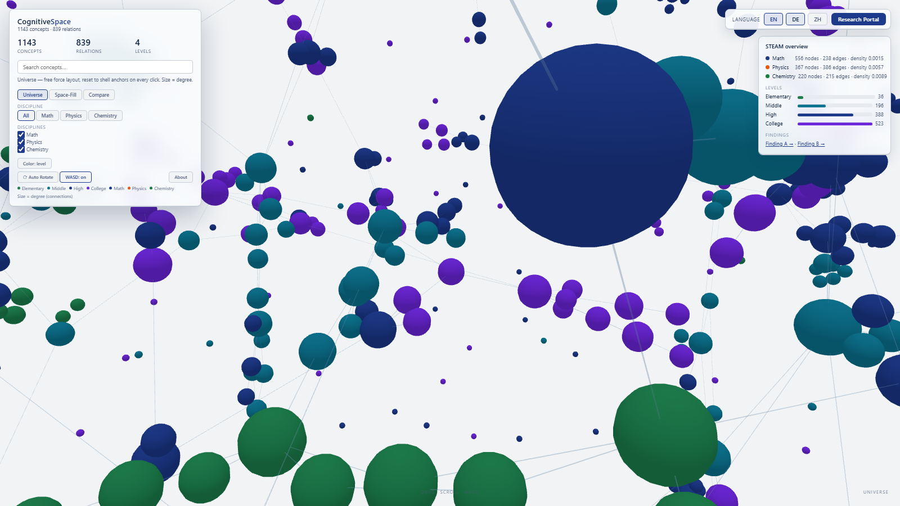
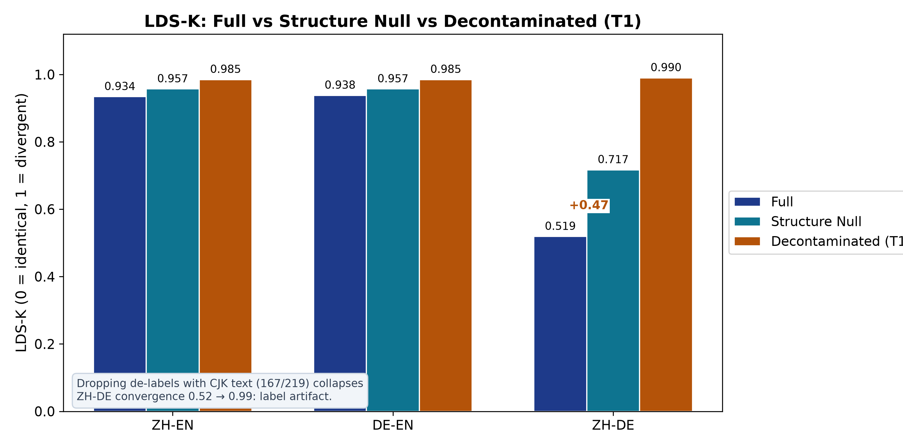

<p align="center">
  <a href="README.md">🇬🇧 English</a> · <a href="README_DE.md">🇩🇪 Deutsch</a> · <a href="README_ZH.md">🇨🇳 中文</a>
</p>

---

<p align="center">
  
</p>

<p align="center">
  <a href="https://jjjjjjjjnnjnn.github.io/BWKI-2026-LinguaGraph/portal/"></a>
  <a href="https://jjjjjjjjnnjnn.github.io/BWKI-2026-LinguaGraph/web/?graph=steam"></a>
  <br><sub>Left: Research Portal · Right: STEAM overview (1,143 nodes · 839 links, no cross-links) — click either to open live</sub>
</p>

<h1 align="center">🧠 LinguaGraph</h1>

<p align="center">
  <b>How do different languages and educational systems organize the same knowledge?</b>
</p>

<p align="center">
  <a href="https://jjjjjjjjnnjnn.github.io/BWKI-2026-LinguaGraph/portal/" style="display:inline-block;padding:14px 36px;background:linear-gradient(135deg,#60a5fa,#a78bfa);color:#fff;border-radius:10px;font-weight:700;font-size:1.15rem;text-decoration:none;box-shadow:0 4px 16px rgba(96,165,250,.3)">
    🧠 Research Portal →
  </a>
  &nbsp;&nbsp;
  <a href="submission/final/LinguaGraph_BWKI2026.pdf" style="display:inline-block;padding:14px 28px;background:#1e293b;border:1px solid #2d3a50;color:#e2e8f0;border-radius:10px;font-weight:600;font-size:1.05rem;text-decoration:none">
    📄 Paper (PDF)
  </a>
  &nbsp;&nbsp;
  <a href="https://jjjjjjjjnnjnn.github.io/BWKI-2026-LinguaGraph/" style="display:inline-block;padding:14px 28px;background:#1e293b;border:1px solid #2d3a50;color:#e2e8f0;border-radius:10px;font-weight:600;font-size:1.05rem;text-decoration:none">
    🌌 CognitiveSpace 3D
  </a>
</p>

<p align="center">
  <a href="https://github.com/jjjjjjjjnnjnn/BWKI-2026-LinguaGraph/stargazers">
    
  </a>
  <a href="https://github.com/jjjjjjjjnnjnn/BWKI-2026-LinguaGraph/blob/master/LICENSE">
    
  </a>
  <a href="https://github.com/jjjjjjjjnnjnn/BWKI-2026-LinguaGraph/commits/master">
    
  </a>
  
  
  
  
</p>

<p align="center">
  🇩🇪 <a href="README_DE.md">Deutsche Version</a> &nbsp;·&nbsp; 🇨🇳 <a href="README_ZH.md">中文版本</a>
</p>

---

## 🔥 Why LinguaGraph?

Mathematical truth is universal, but its organization in textbooks varies dramatically across languages and educational systems. **LinguaGraph is the first automated framework** that builds trilingual knowledge graphs at scale (1,143 concepts), quantifies structural differences, measures curriculum alignment across 4 systems — validates extraction against **92 gold labels** — and **falsifies its own readings** (T1 decontamination, reported not hidden).

---

## 🗺️ Navigate this project (start here)

| Entry | What you get | Best for |
|-------|--------------|----------|
| [🧠 Research Portal](https://jjjjjjjjnnjnn.github.io/BWKI-2026-LinguaGraph/portal/) | Findings F1–F12, replication roster (**59/54/177**), margin galaxy, validation section | **Judges & reviewers — start here** |
| [🌐 STEAM overview](https://jjjjjjjjnnjnn.github.io/BWKI-2026-LinguaGraph/web/?graph=steam) | All 3 disciplines side-by-side in one 3D graph (1,143 nodes · 839 links, no cross-links) + compare panel | Cross-subject comparison |
| [📄 Paper (PDF)](submission/final/LinguaGraph_BWKI2026.pdf) | Full paper, frozen figures + values | Academic reading, citation |
| [🌌 CognitiveSpace 3D](https://jjjjjjjjnnjnn.github.io/BWKI-2026-LinguaGraph/) | Interactive 3D knowledge graph (1,143 concepts) | Live demo, audience |
| [`submission/final/`](submission/final/) | BWKI submission package (answers, disclosure, code guide) | Competition submission |
| [`docs/`](docs/) | 80+ docs — paper sources, audits, ledger ([`INDEX.md`](docs/INDEX.md)) | Deep dive, verification |

---

## 🎯 Key results (30 seconds)

- **59/54/177 replication**: 59 complete measurements (54 unique models) on one P1 protocol (ZH/DE/EN × 10 prompts) — every ZH–DE pair significant (p<0.05); file-truth 62/57/186 incl. partial qwen-max run (n=26/30).
- **Extraction quality**: 92 gold labels — social F1 **0.939**† (n=72, Batch B Developing — see note below), math F1 0.674 (n=20), weighted overall **0.881**.
- **Self-falsification (T1)**: dropping German labels containing CJK text (167/219) collapses ZH–DE "convergence" 0.52 → 0.99 — the F4 convergence reading is a label artefact, and we report it.
- **Human study (N=15)**: no separable language signal under between-subject design (LDS-C ≈ floor) — language effects require within-subject designs (LLM: +0.08–0.09 ≫ floor).
- **Scale**: 1,143 concepts · 1,100+ relations · 204 textbooks · 4 curricula (CN 95.4% · UK 37.3% · US 17.2% · NRW 12.7%).

---

## ✅ Evidence snapshot

**92 gold-standard annotations** across 2 domains and 3 languages (production extraction model, Bailian API):

| Domain | ZH F1 | DE F1 | EN F1 | Overall | n |
|--------|:-----:|:-----:|:-----:|:-------:|:-:|
| **Social concepts** | **0.974** | **0.949** | **0.882** | **0.939** | 72 |
| **Mathematics** | 0.857 | 0.506 | 0.711 | 0.674 | 20 |
| **All (weighted)** | 0.951 | 0.842 | 0.844 | **0.881** | **92** |

> Overall = weighted mean over domains ((72×0.939+20×0.674)/92≈0.881). The headline 0.939 applies to the social subset only. Caveats: 72 social labels are machine-accepted (`auto_accepted`); math-DE (0.506) is n=7, high variance. Provenance: Batch A math 20 hand-annotated (Mature/C9a); Batch B social 72 machine-seeded+human-accepted (Developing/C9b, 72-label blind review pending; independent harness ~0.65 vs DB path 0.939 — see G3 note `research/gold_deconfound_2026-09-14.md`).

<p align="center">
  
  <br><sub><b>Fig8 (T1)</b> — the headline ZH–DE convergence does not survive decontamination. Frozen values: ZH-EN 0.9336 / DE-EN 0.9382 / ZH-DE 0.5188.</sub>
</p>

**🧑 Human Validation (N=15 extended; N=8 pilot not replicated)**
- Concept-level LDS-C **0.93–0.96 ≈ within-language split-half floor (0.92–0.96) ≈ label permutation (0.94)** — **ΔLDS ≈ 0** (−0.05…+0.05); pilot N=8 values (0.70–0.75) not replicated, reported for transparency only.

**🧪 Null Model (Structure vs Full Graphs)**
- Full LDS-K **0.73** vs structure-only **0.77** (means) — Full < Structure for all pairs; taxonomy explains most variance.

> See [`docs/paper/02_methodology.md`](docs/paper/02_methodology.md) for full methodology and [`docs/BASELINE_LEDGER.md`](docs/BASELINE_LEDGER.md) for the frozen baseline ledger.

---

## 🧪 Model Benchmark

**59 complete measurements (54 unique models)** on the identical P1 protocol (3 languages × k=10), plus the 19-model extraction benchmark (F1 range 0.55–0.67) — best extraction results below. Replication: [`data/lds_c/llm_subject/multi_model_replication_20260913.json`](data/lds_c/llm_subject/multi_model_replication_20260913.json); all 59 ZH–DE pairs significant (p<0.05), 9 English-involved pairs not (8× R1/Distill + phi-4-mini ZH-EN).

| Model | Domain | ZH F1 | DE F1 | EN F1 | Speed |
|-------|--------|:-----:|:-----:|:-----:|:-----:|
| **qwen-plus** | **Social** | **0.974** | **0.949** | **0.882** | 2-3s |
| qwen-turbo | Math | 0.714 | 0.448 | 0.810 | 1s |
| qwen3.7-max | Math | 0.980 | 0.551 | 0.778 | 2-3s |
| glm-4.6 | Math | 0.951 | 0.595 | 0.689 | 10-20s |

> Dual accounting: published **59/54/177** excludes the partial qwen-max run (n=26/30); file-truth **62/57/186**. Collecting: **26** = 23 incomplete + 2 sparse small-model boundary (qwen2.5 n.s., hy-mt2 NaN) + 1 quarantine (gemma).

---

## 📊 Dataset

| Subject | Concepts | Relations | Textbooks | Languages | Curriculum Coverage |
|---------|:--------:|:---------:|:---------:|:---------:|:------------------:|
| **Mathematics** | 556 | 525 direct (+~3000 transitive) | 68 (32 cited in-graph) | ZH/EN/DE | NRW 12.7% · UK 37.3% · US 17.2% · CN 95.4% |
| **Physics** | 367 | 386 | 83 titles (96 refs) | ZH/EN/DE | NRW coverage NA |
| **Chemistry** | 220 | 215 | 89 titles | ZH/EN/DE | NRW 36% |
| **Total** | **1,143** | **1,100+ direct** | **204** | **3 languages** | **4 educational systems** |

> SSOT: math counts from `manifest.json` (556/525/219). Full caliber table: `docs/SSOT-web.md` (口径冻结). Titles total **204 = 32 (math) + 83 (physics) + 89 (chemistry)**.

---

## 📐 Metrics at a Glance

| Metric | Full Name | Formula | What It Reveals |
|--------|-----------|---------|-----------------|
| **CDS** | Concept Density Score | 2\|E\|/(\|V\|·(\|V\|−1)) | Knowledge interconnection density per education level |
| **HDS** | Hierarchy Depth Score | BFS on prerequisite graph | Maximum prerequisite chain length |
| **LDS** | Linguistic Divergence Score (LDS) | 1 − (Jaccard_node + Jaccard_edge) / 2 | Cross-language structural (dis)similarity |
| **CS** | Coverage Score | \|V_textbook ∩ V_curriculum\| / \|V_curriculum\| | Textbook-curriculum alignment (CN 95.4%, NRW 12.7%, UK 37.3%, US 17.2%) |

> LDS uses the frozen v3 formula (2 components, node + edge Jaccard). The 3-component variant in `src/scoring.py` does not reproduce the published values — see `docs/BASELINE_LEDGER.md` §8.

---

## 🏆 12 Findings (F1–F12)

<details>
<summary><b>Click to expand the full finding table</b></summary>

| # | Finding | Evidence | Impact |
|---|---------|----------|--------|
| **F1** | CDS peaks at **Middle school** (0.271), not Elementary | Confirmed independently in ZH, EN, DE | Challenges "knowledge gets denser with level" assumption |
| **F2** | **3.7× density drop** from Middle to High school | 0.271 → 0.073; concept count 4.2× | Curriculum diversification after integration hub |
| **F3** | HDS ≤ **8** (mean 0.40); 83% of concepts are roots | BFS on 525 direct relations (+~3000 transitive) | Mathematics is a shallow web, not a deep tree |
| **F4** | **LDS-K reveals heterogeneous convergence**: ZH-DE (0.519) converges; ZH-EN (0.934), DE-EN (0.938) near noise floor | Direct computation on textbook graphs (freeze: 0.9336/0.9382/0.5188, `outputs/figures/reproduce_lds_binary.log`) | Knowledge-structure LDS diverges from surface-language expectations — but Null Model (F5) falsifies the language reading; math nodes are partly alignment-label artefacts (see `docs/p2_methodology_rechecks.md`) |
| **F5** | LDS is **topic-dependent**; **Null Model** confirms Full < Structure for all pairs | ~0.2 variation within pairs; Full LDS-K=0.73, Structure LDS-K=0.77 | Cross-language divergence varies by knowledge domain; taxonomy alone explains most variance |
| **F6** | **Physics** peaks at **Elementary** (0.222), Math at Middle (0.271) | 367 physics concepts, 3 languages | Both follow "integrate-early, diverge-late" pattern |
| **F7** | Physics has **2.1× deeper** prerequisite chains | HDS mean 0.85 vs 0.40 | Physics knowledge is more cumulative and sequential |
| **F8** | **Chemistry** peaks at Middle (0.042), 6.5× lower than Math | 220 chemistry concepts | Consistent with, but not confirming, the cross-subject density pattern (small absolute gap 0.012, no test) |
| **F9** | **Coverage Score** varies dramatically across systems | NRW 12.7%, UK 37.3%, US 17.2%, CN 95.4% (keyword matching; granularity confound: CN 87 vs US 2124 vs NRW 299 curriculum concepts) | Measurement strong, governance attribution weak — CS gap is primarily a hypothesis (see F10) |
| **F10** | Coverage trajectories suggest a **governance hypothesis** | UK exam-driven convergence; NRW specialization divergence; China centralized near-total alignment | Hypothesis only: centralized (CN MOE) vs federal (DE Länder/KMK) institutional context is documented (TIMSS 2023 Encyclopedia; OECD EAG 2025), but classroom-implementation chain is untested |
| **F11** | **N=15 falsifies ΔLDS > 0 under between-subject design**; **ΔLDS** retained as metric for within-subject use | N=15 (6 DE · 6 ZH · 3 EN): LDS-C 0.93–0.96 ≈ split-half floor; pilot N=8 not replicated | Between-subject designs cannot separate language from participant variance; within-subject design required |
| **F12** | Concept-level **ΔLDS ≈ 0** (−0.05…+0.05); relation-level Δ not comparable | N=15 + LLM within-subject (LDS-C ≫ floor +0.08–0.09) | Language signal exists within-subject (LLM), absent between-subject (human) — design artefact, not proof of no effect; earlier sim comparison withdrawn |

> **T1 decontamination (Fig8):** dropping German labels containing CJK text (167/219, 52 kept) collapses ZH–DE convergence 0.52 → 0.99 — the F4 "convergence" is a label artefact, **falsified**. Chart: `outputs/figures/fig8_lds_decontamination.png`, script `scripts/figures/fig8_lds_decontamination.py`. Fig4 null-model suite: `scripts/figures/fig4_null_model.py`.

</details>

---

## 🚀 Quick Start

```bash
# 1. Install & configure
git clone https://github.com/jjjjjjjjnnjnn/BWKI-2026-LinguaGraph.git
cd BWKI-2026-LinguaGraph
pip install openai numpy
export BAILIAN_API_KEY="your-api-key"

# 2. Validate extraction quality against 92 gold labels (5 min)
python scripts/batch_process_responses.py --gold-only
python scripts/evaluate_gold.py

# 3. Reproduce frozen values (LDS-K 0.9336/0.9382/0.5188; Fig4/Fig8)
python scripts/figures/reproduce_lds_binary.py
python scripts/figures/fig4_null_model.py
python scripts/figures/fig8_lds_decontamination.py
```

Products: `outputs/figures/reproduce_lds_binary.log`, `fig4_null_model_data.csv`, `fig8_lds_decontamination_data.csv` (+ PNGs, mirrored to `cognitive-space/web/figures/`). Ledger: `docs/BASELINE_LEDGER.md` §8/§10.

> The Research Portal is a zero-build static site published from `_deploy/` via GitHub Pages (`.github/workflows/deploy-cognitive-space.yml` on push to master). Local preview: open `cognitive-space/portal/index.html` in a browser.

### Methodology in five steps (cf. `docs/paper/02_methodology.md` §§2.1–2.5)
1. **Textbook Corpus** — 68 math volumes (+ physics 367-node / chemistry 220-node graphs), ZH/EN/DE
2. **Concept Extraction (MIMO)** — structured LLM prompts → 75 JSON files → 556 concepts, 525 relations
3. **Graph Construction and Fusion** — merge → dedup (556) → directed graph (+~3000 transitive edges)
4. **Cross-lingual Alignment** — 30 shared IDs → 219 trilingual groups (39%) → CDS/HDS/LDS/CS metrics
5. **Validation & Falsification** — 92 gold labels, N=15 human study, null-model suite, T1 decontamination

### Tool layering (paper §2.12, Eigenständigkeit)
Own contributions: design, LDS definition, all findings/falsification analyses. Disclosed auxiliary tooling (not mixed with string-match counts): **networks/graphs** NetworkX + 3d-force-graph · **figures** matplotlib (`scripts/figures/`) · **text extraction** pymupdf + RapidOCR-ONNX (DirectML-GPU) · **semantics** nomic-embed-v1.5 pre-screen + Muse-Spark adjudication (temp-0, `scripts/semantic_ground_en.py`) · **concept extraction (D1)** Bailian API qwen-plus (gold N=92, social F1 0.939).

---

## 📁 Project Structure

```
├── scripts/              # Analysis pipelines (batch extraction, evaluation, benchmark)
│   ├── math_graph_pipeline/  # Canonical pipeline (SSOT: merge→align→export→validate)
│   ├── figures/              # Deterministic figure scripts (Fig2/Fig4/Fig8 + freeze + utils)
│   ├── release.py            # Unified release (gates→export→manifest→bundle)
│   └── build_paper_pdf.py    # Paper assembly (docs/paper → submission PDF)
├── docs/
│   ├── INDEX.md          # Navigation for all 80+ docs
│   ├── SSOT-web.md       # Portal/3D number conventions + caliber freeze (口径冻结)
│   ├── BASELINE_LEDGER.md # Baseline ledger (8 baselines + Fig4/Fig8 frozen values)
│   ├── paper/            # Full research paper (reading order: see ORDER in build_paper_pdf.py)
│   ├── review/           # Quality audits & critical assessments
│   ├── ethics/           # GDPR compliance & consent forms
│   └── submission/       # BWKI submission (PDF + platform answers + checklist)
├── submission/
│   ├── final/            # Final package (PDF + answers + disclosure + code guide)
│   ├── pitch/            # Video pitch (script v2 + storyboard; recording separate)
│   └── idea/             # Ideenanmeldung 28.06. (historical)
├── config/
│   ├── expert_graphs/    # Knowledge graphs (JSON) — Math, Physics, Chemistry, Curricula
│   └── cross_language_mapping.json  # 30 shared concept IDs (frozen)
├── cognitive-space/      # 3D visualization (Three.js) + portal/
├── research_lab/         # Sandboxed experiments (gitignored skills/)
├── release/              # Immutable snapshot (manifest + data.js + checksums)
├── freeze/               # Frozen survey samples (immutable)
└── manifest.json         # SSOT numbers (556/525/219)
```

---

## 📚 References

### Academic Papers

| # | Reference | Paper | Relevance |
|---|-----------|-------|-----------|
| 1 | **Novak, J. D. & Cañas, A. J.** (2008). *The theory underlying concept maps and how to construct and use them.* | [13] | Foundational — concept mapping theory underpinning CDS/HDS |
| 2 | **Ausubel, D. P.** (1963). *The psychology of meaningful verbal learning.* Grune & Stratton. | [12] | Assimilation theory — knowledge is structured, not listed |
| 3 | **Schmidt, W. H. et al.** (2001). *Why schools matter: A cross-national comparison of curriculum and learning.* Jossey-Bass. | [54] | TIMSS curriculum coherence — Coverage Score inspiration |
| 4 | **Liang, S. & Heckmann, K.** (2013). *Comparing German and Chinese mathematics textbooks.* ZDM, 45(5), 743–756. | [8] | Cross-national textbook comparison methodology |
| 5 | **Boroditsky, L.** (2001). *Does language shape thought?: Mandarin and English speakers' conceptions of time.* Cognitive Psychology, 43(2). | [53] | Linguistic relativity — research question context |
| 6 | **Siew, C. S. Q.** (2019). *Applications of network science to education research.* In: Network Science in Education. Springer. | — (background) | Network analysis of cognitive/educational structures |
| 7 | **Ain, Q. U., Chatti, M. A., & Qussa, J.** (2025). *An optimized pipeline for automatic educational knowledge graph construction.* arXiv:2509.05392. | [3] | Most directly relevant EKG pipeline methodology |
| 8 | **Alatrash, R., Chatti, M. A., & Wibowo, N.** (2025). *Inferring prerequisite knowledge concepts in educational knowledge graphs.* arXiv:2509.05393. | [5] | Prerequisite inference — supports HDS metric |
| 9 | **Fan, L., Zhu, Y., & Miao, Z.** (2013). *Textbook research in mathematics education.* ICMT. | [9] | Cross-national textbook problem analysis |
| 10 | **OECD.** (2025). *Education at a Glance 2025.* OECD Publishing. | [32] | Cross-national curriculum structure data |
| 11 | **IEA.** (2023). *TIMSS 2023.* | [6] / [30] | Curriculum coverage analysis methodology |
| 12 | **Vaswani, A. et al.** (2017). *Attention Is All You Need.* NeurIPS. | — (background) | Transformer architecture — foundational for LLMs used |

<details>
<summary><b>Libraries, curriculum standards, textbook corpora, acknowledgments</b></summary>

### Open Source Libraries

| Library | Usage | License |
|---------|-------|---------|
| [openai/openai-python](https://github.com/openai/openai-python) | LLM API client for concept extraction | MIT |
| [networkx/networkx](https://github.com/networkx/networkx) | Graph construction and analysis (CDS, HDS) | BSD-3 |
| [matplotlib/matplotlib](https://github.com/matplotlib/matplotlib) | Figure generation (Fig 2/4/8 et al.) | PSF |
| [numpy/numpy](https://github.com/numpy/numpy) | Numerical computation, similarity metrics | BSD-3 |
| [scipy/scipy](https://github.com/scipy/scipy) | Statistical analysis, correlation tests | BSD-3 |
| [scikit-learn/scikit-learn](https://github.com/scikit-learn/scikit-learn) | Baseline models and evaluation | BSD-3 |
| [Three.js](https://github.com/mrdoob/three.js) | 3D knowledge graph visualization (CognitiveSpace) | MIT |
| [Flask](https://github.com/pallets/flask) | Workbench web application | BSD-3 |
| [seaborn/seaborn](https://github.com/mwaskom/seaborn) | Statistical data visualization | BSD-3 |

### Curriculum Standards (Primary Sources)

| Standard | Publisher |
|----------|-----------|
| Kernlehrplan Mathematik/Physik/Chemie NRW (Sek I 2019, Sek II 2023) | MSB NRW |
| UK National Curriculum (Mathematics, Science) | DfE England |
| US Next Generation Science Standards (NGSS) | NGSS Lead States |
| Chinese National Curriculum Standards (数学/物理/化学) | MoE China |

### Textbook Corpora

Textbook content used for knowledge graph construction (academic research, fair use). Full attribution in graph metadata files.

**ZH** (33+ publishers): 人教版, 沪科版, 北师大版, 苏科版, 粤教版, 鲁科版, 马文蔚, 程守洙, 漆安慎, 赵凯华, 汪志诚, 杨福家, 梁昆淼, 郭硕鸿, 曾谨言

**EN** (34+ publishers): Khan Academy, CK-12, AP Physics, IB, IGCSE, GCSE, Halliday Resnick Walker, Serway Jewett, Young Freedman, Griffiths, Kittel, Feynman Lectures, Stewart Calculus, Strang Linear Algebra

**DE** (27+ publishers): Duden, Lambacher Schwere, Westermann, Cornelsen, Klett, Auer, Dorn-Bader, Kern, Thieme, Tipler, Demtröder, Jackson, Papula, Fischer

### Acknowledgments

- **BWKI 2026** — Competition platform and framework
- **Schloss Heessen** — Boarding school in Hamm, Germany; institutional support and educational guidance
- **OpenCode GO** — AI service platform providing model API access
- **Claude Code** — AI-assisted development platform (Anthropic)
- **MimoCode** — AI service platform via OpenCode GO
- **Alibaba Cloud Bailian** — Free API quota (1M tokens per model)
- **OpenRouter** — Model routing (tested)
- **LM Studio** — Local inference (initial development)

</details>

## 📜 Citation

```bibtex
@misc{linguaGraph2026,
  author = {Rong, Jiajun and Lan, Zhenxi},
  title = {LinguaGraph: Cross-Lingual Knowledge Structure Analysis Framework},
  year = {2026},
  publisher = {GitHub},
  journal = {BWKI 2026 — Bundeswettbewerb K{\"u}nstliche Intelligenz},
  url = {https://github.com/jjjjjjjjnnjnn/BWKI-2026-LinguaGraph}
}
```

---

## 📜 License & Compliance

- **License**: All Rights Reserved — BWKI 2026 competition project
- **Privacy**: Participant data fully anonymized. No PII in repository. See [`docs/ethics/`](docs/ethics/) for GDPR compliance.
- **AI Ethics**: LLM usage limited to concept extraction from textbook text. No synthetic data presented as human data.
- **Data Sources**: Textbook excerpts used for academic research under fair use principles.

---

## 🤝 Contact

- **Competition**: [BWKI 2026](https://www.bw-ki.de/)
- **Repository**: [github.com/jjjjjjjjnnjnn/BWKI-2026-LinguaGraph](https://github.com/jjjjjjjjnnjnn/BWKI-2026-LinguaGraph)
- **3D Demo**: Open [`cognitive-space/web/index.html`](cognitive-space/web/index.html) in your browser
- **Authors**: Jiajun Rong & Zhenxi Lan — Privatschule Schloss Heessen (BWKI 2026 team)

<p align="center">
  <sub>Built with ❤️ for BWKI 2026 — because knowledge should be understood, not just taught.</sub>
</p>
<p align="center">
  <a href="https://jjjjjjjjnnjnn.github.io/BWKI-2026-LinguaGraph/portal/" style="display:inline-block;padding:14px 36px;background:linear-gradient(135deg,#60a5fa,#a78bfa);color:#fff;border-radius:10px;font-weight:700;font-size:1.15rem;text-decoration:none">
    🧠 LinguaGraph Research Portal →
  </a>
  <br>
  <span style="color:#94a3b8;font-size:0.85rem">Research Questions · Findings · Interactive 3D · Validation · Paper</span>
</p>


<p align="center">
  <a href="README_DE.md">🇩🇪 Deutsch</a> · <a href="README_ZH.md">🇨🇳 中文</a>
</p>
