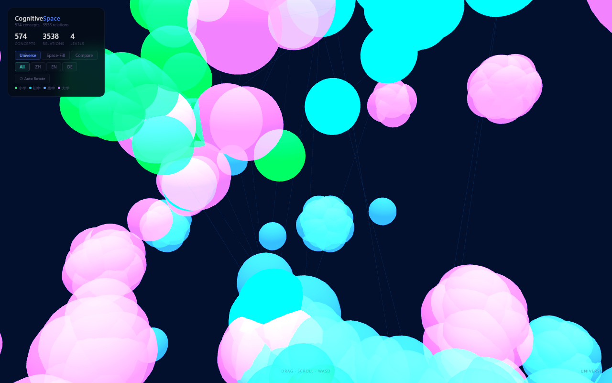

<p align="center">
  <a href="README.md">🇬🇧 English</a> · <a href="README_DE.md">🇩🇪 Deutsch</a> · <a href="README_ZH.md">🇨🇳 中文</a>
</p>

---

<p align="center">
  
</p>

<h1 align="center">🧠 LinguaGraph</h1>


<p align="center">
  <a href="https://jjjjjjjjnnjnn.github.io/BWKI-2026-LinguaGraph/portal/" style="display:inline-block;padding:14px 36px;background:linear-gradient(135deg,#60a5fa,#a78bfa);color:#fff;border-radius:10px;font-weight:700;font-size:1.15rem;text-decoration:none;box-shadow:0 4px 16px rgba(96,165,250,.3)">
    🧠 Forschungsportal →
  </a>
  &nbsp;&nbsp;
  <a href="https://jjjjjjjjnnjnn.github.io/BWKI-2026-LinguaGraph/" style="display:inline-block;padding:14px 28px;background:#1e293b;border:1px solid #2d3a50;color:#e2e8f0;border-radius:10px;font-weight:600;font-size:1.05rem;text-decoration:none">
    🌌 CognitiveSpace 3D
  </a>
  &nbsp;&nbsp;
  <a href="docs/paper/" style="display:inline-block;padding:14px 28px;background:#1e293b;border:1px solid #2d3a50;color:#e2e8f0;border-radius:10px;font-weight:600;font-size:1.05rem;text-decoration:none">
    📄 Paper
  </a>
</p>


<p align="center">
  <b>How do different languages and educational systems organize the same knowledge?</b>
</p>

<p align="center">
  <a href="https://github.com/jjjjjjjjnnjnn/BWKI-2026-LinguaGraph/stargazers">
    
  </a>
  <a href="https://github.com/jjjjjjjjnnjnn/BWKI-2026-LinguaGraph/blob/master/LICENSE">
    
  </a>
  <a href="https://github.com/jjjjjjjjnnjnn/BWKI-2026-LinguaGraph/commits/master">
    
  </a>
  
  
  
  
  
  
  
  
  
</p>

<p align="center">
  🇩🇪 <a href="README_DE.md">Deutsche Version</a> &nbsp;·&nbsp; 🇨🇳 <a href="README_ZH.md">中文版本</a>
</p>

---

## 📑 Inhaltsverzeichnis

<details>
<summary><b>Klicken zum Erweitern/Einklappen</b></summary>

- [🔥 Warum LinguaGraph?](#-warum-linguagraph)
- [📐 Metriken im Überblick](#-metriken-im-überblick)
- [🏆 12 Erkenntnisse (F1–F12)](#-12-erkenntnisse-f1f12)
- [📊 Datensatz](#-datensatz)
- [✅ Extraktion und Humanvalidierung](#-extraktion-und-humanvalidierung)
- [🚀 Schnellstart](#-schnellstart)
- [🧪 Modellvergleich](#-modellvergleich)
- [📁 Projektstruktur](#-projektstruktur)
- [📚 Literaturverzeichnis](#-literaturverzeichnis)
- [📜 Zitationshinweis](#-zitationshinweis)
- [📜 Lizenz & Compliance](#-lizenz--compliance)
- [🤝 Kontakt](#-kontakt)

</details>

---

## 🔥 Warum LinguaGraph?

Mathematische Wahrheit ist universell, aber die Art und Weise, wie sie in Lehrbüchern organisiert ist, variiert erheblich zwischen Sprachen und Bildungssystemen. Bestehende Lehrplananalysewerkzeuge sind qualitativ, manuell und können nicht über mehrere Sprachen oder Disziplinen hinweg skaliert werden.

**LinguaGraph ist das erste automatisierte Framework, das:**

- 🧩 **Mehrsprachige Wissensgraphen** aus Lehrbüchern in großem Maßstab erstellt (1.140+ Konzepte, 3 Sprachen)
- 📏 **Strukturelle Unterschiede** zwischen Sprachen, Bildungssystemen und Disziplinen quantifiziert
- 🎯 **Lehrbuch-Lehrplan-Abgleich** über 4 Bildungssysteme hinweg misst (Deutschland, Großbritannien, USA, China)
- ✅ Extraktionsqualität mit **92 Goldstandard-Annotationen** validiert (gewichtetes F1 = 0,881; Sozial-Subset F1 = 0,939)
- 🔬 Falsifiziert eigene Lesarten: Der T1-Dekontaminationstest kollabiert die headline ZH–DE-Konvergenz (0,52 → 0,99), und das Ergebnis wird berichtet — siehe [🏆 12 Erkenntnisse](#-12-erkenntnisse-f1f12) (F4/F5) und [📊 Datensatz](#-datensatz)

> **Es verwandelt die unsichtbare Struktur von Wissen in sichtbare, messbare Metriken — einschließlich der Messungen, die ihm widersprechen.**

---

## 📐 Metriken im Überblick

| Metrik | Bezeichnung | Formel | Bedeutung |
|--------|-----------|---------|-----------------|
| **CDS** | Concept Density Score | 2\|E\|/(\|V\|·(\|V\|−1)) | Vernetzungsdichte des Wissens pro Bildungsstufe |
| **HDS** | Hierarchy Depth Score | BFS on prerequisite graph | Maximale Länge der Voraussetzungskette |
| **LDS** | Linguistic Divergence Score (LDS) | 1 − (Jaccard_node + Jaccard_edge) / 2 | Strukturelle (Un-)Ähnlichkeit über Sprachen hinweg |
| **CS** | Coverage Score | \|V_textbook ∩ V_curriculum\| / \|V_curriculum\| | Lehrbuch-Lehrplan-Abgleich (updated: CN 95.4%, NRW 12.7%, UK 37.3%, US 17.2%) |

> LDS nutzt die eingefrorene v3-Formel (2 Komponenten, Knoten- + Kanten-Jaccard). Die 3-Komponenten-Variante in `src/scoring.py` reproduziert die publizierten Werte nicht — siehe `docs/BASELINE_LEDGER.md` §8.

---

## 🏆 12 Erkenntnisse (F1–F12)

| # | Erkenntnis | Beleg | Auswirkung |
|---|---------|----------|--------|
| **F1** | CDS erreicht Höhepunkt in **Mittelstufe** (0,271), nicht in Grundschule | Unabhängig bestätigt in ZH, EN, DE | Stellt die Annahme "Wissen wird mit der Stufe dichter" in Frage |
| **F2** | **3,7× Dichteabfall** von Mittel- zur Oberstufe | 0,271 → 0,073; Konzeptanzahl 4,2× | Lehrplandiversifizierung nach Integrationsknotenpunkt |
| **F3** | HDS ≤ **8** (Mittel 0,40); 83% der Konzepte sind Wurzeln | BFS auf 525 direkten Relationen (+~3000 transitiv) | Mathematik ist ein flaches Netz, kein tiefer Baum |
| **F4** | **LDS-K zeigt heterogene Konvergenz**: ZH-DE (0,519) konvergiert; ZH-EN (0,934), DE-EN (0,938) nahe Rauschschwelle | Direkte Berechnung auf Lehrbuchgraphen (Freeze: 0.9336/0.9382/0.5188, `outputs/figures/reproduce_lds_binary.log`) | Wissensstruktur-LDS weicht von oberflächlichen Spracherwartungen ab — aber Nullmodell (F5) falsifiziert die Sprachlesart; Matheknoten teils Alignierungs-Artefakte (s. `docs/p2_methodology_rechecks.md`) |
| **F5** | LDS ist **themenabhängig**; **Nullmodell** bestätigt Full < Structure für alle Paare | ~0,2 Variation innerhalb der Paare; Full LDS-K=0,73, Structure LDS-K=0,77 | Sprachübergreifende Divergenz variiert nach Wissensdomäne; Taxonomie allein erklärt den Großteil der Varianz |
| **F6** | **Physik** erreicht Höhepunkt in **Grundschule** (0,222), Mathe in Mittelstufe (0,271) | 367 Physikkonzepte, 3 Sprachen | Beide folgen dem Muster "früh integrieren, spät divergieren" |
| **F7** | Physik hat **2,1× tiefere** Voraussetzungsketten | HDS-Mittelwert 0,85 vs. 0,40 | Physikwissen ist kumulativer und sequenzieller |
| **F8** | **Chemie** erreicht Höhepunkt in Mittelstufe (0,042), 6,5× niedriger als Mathe | 220 Chemiekonzepte | Konsistent mit, aber kein Beleg für das fächerübergreifende Dichtemuster (kleine absolute Differenz 0,012, kein Test) |
| **F9** | **Abdeckungsgrad** variiert dramatisch zwischen Systemen | NRW 12,7%, UK 37,3%, US 17,2%, CN 95,4% (Keyword-Matching; Granularitäts-Confound: CN 87 vs. US 2124 vs. NRW 299 Curriculums-konzepte) | Messung stark, Governance-Zuschreibung schwach — CS-Lücke primär Hypothese (s. F10) |
| **F10** | Abdeckungsverläufe legen eine **Governance-Hypothese** nahe | UK prüfungsgetriebene Konvergenz; NRW Spezialisierungsdivergenz; China zentralisierte Vollausrichtung | Nur Hypothese: zentralisierter (CN MoE) vs. föderaler (DE Länder/KMK) Kontext ist dokumentiert (TIMSS-2023-Enzyklopädie; OECD EAG 2025), Unterrichts-Implementierungskette ungetestet |
| **F11** | **N=15 falsifiziert ΔLDS > 0 unter Between-Subject-Bedingungen**; **ΔLDS** bleibt Metrik für Within-Subject-Nutzung | N=15 (6 DE · 6 ZH · 3 EN): LDS-C 0,93–0,96 ≈ Split-Half-Boden; Pilot N=8 nicht repliziert | Between-Subject-Designs trennen Sprache nicht von Teilnehmervarianz; Within-Subject-Design erforderlich |
| **F12** | Konzept-**ΔLDS ≈ 0** (−0,05…+0,05); Relationsebene nicht vergleichbar | N=15 + LLM-Within-Subject (LDS-C ≫ Boden +0,08–0,09) | Sprachsignal within-subject vorhanden (LLM), between-subject abwesend (Mensch) — Design-Artefakt-Hypothese, kein Beleg für Nulleffekt; früherer Sim-Vergleich zurückgezogen |

> **T1-Dekontamination (Abb. 8):** Entfernen deutscher Labels mit CJK-Text (167/219, 52 behalten) kollabiert die ZH–DE-Konvergenz 0,52 → 0,99 — die F4-„Konvergenz" ist ein Label-Artefakt, **falsifiziert**. Chart: `outputs/figures/fig8_lds_decontamination.png` (+`_de`/`_zh`, CSV daneben), Skript `scripts/figures/fig8_lds_decontamination.py`. Abb.4-Nullmodell-Suite: `scripts/figures/fig4_null_model.py`.

---

## 📊 Datensatz

| Fach | Konzepte | Beziehungen | Lehrbücher | Sprachen | Lehrplanabdeckung |
|---------|:--------:|:---------:|:---------:|:---------:|:------------------:|
| **Mathematik** | 556 | 525 direkt (+~3000 transitiv) | 68 (32 im Graph zitiert) | ZH/EN/DE | NRW 12.7% · UK 37.3% · US 17.2% · CN 95.4% |
| **Physik** | 367 | 386 | 83 Titel (96 Refs) | ZH/EN/DE | NRW-Abdeckung n. v. |
| **Chemie** | 220 | 215 | 89 Titel | ZH/EN/DE | NRW 36% |
| **Gesamt** | **1.140+** | **1.100+ direkt** | **204** | **3 Sprachen** | **4 Bildungssysteme** |

> **Zählkonvention (eingefroren 2026-09-12):** Mathe dreistufig — **68** Input-Korpus-Bände (75 JSON-Extraktionsdateien inkl. Kapitelsplits) / **72** Rohbibliothek-Titel (Vordedup-Katalog) / **32** im Graph zitierte Titel (`source_references`, einzige zitierfähige Schicht). Titel gesamt **204 = 32 (Mathe) + 83 (Physik) + 89 (Chemie)** = Portal `#sources`. Physik 367/386 inkl. Sensorknoten (`physics_em_传感器` + 3 Requires-Links); Chemie 220/215 ist die Post-Backfill-Baseline (218+2, 0 dangling).

> SSOT: Mathe-Graphenzahlen aus `manifest.json` (556 Knoten / 525 direkte Relationen / 219 trilinguale Gruppen). Physik-/Chemiezahlen aus Legacy-Pipelines (s. `docs/review/rnd_project_review_20260811.md` §7). Vollständige Kalibertabelle: `docs/SSOT-web.md` (Portaleinfrierung).

---

## ✅ Extraktion und Humanvalidierung

**92 Goldstandard-Annotationen** über 2 Domänen und 3 Sprachen (Bailian-API-Extraktion):

| Bereich | ZH F1 | DE F1 | EN F1 | Gesamt | n |
|--------|:-----:|:-----:|:-----:|:-------:|:-:|
| **Soziale Konzepte** | **0,974** | **0,949** | **0,882** | **0,939** | 72 |
| **Mathematik** | 0,857 | 0,506 | 0,711 | 0,674 | 20 |
| **Alle (gewichtet)** | 0,951 | 0,842 | 0,844 | **0,881** | **92** |

> Gesamt = domänengewichtetes Mittel ((72×0,939+20×0,674)/92≈0,881). Die Kopfzahl 0,939 gilt nur für die Sozial-Subgruppe.

> Fehleranalyse: 29% der Fehler stammen von sehr kurzen Antworten (1-2 Wörter); 40% von teilweisen Auslassungen. Keine systematische Fehlleitung.

**🧑 Humanvalidierungsstudie (N=15 erweitert; N=8-Pilot nicht repliziert)**
- Erweiterte Studie (6 DE · 6 ZH · 3 EN): Konzept-LDS-C **0,93–0,96 ≈ Within-Language-Split-Half-Boden (0,92–0,96) ≈ Label-Permutation (0,94)** — kein separierbares Sprachsignal unter Between-Subject-Bedingungen; **ΔLDS ≈ 0** (Konzeptebene; Relationsebene nicht vergleichbar)
- Pilot N=8 (0,70–0,75) **nicht repliziert** — nur aus Transparenz berichtet
- Lehrbuch-LDS-K: **ZH–EN (0,934) ≈ DE–EN (0,938) ≫ ZH–DE (0,519)** — aber siehe Nullmodell: LDS-K misst keine Sprachdivergenz

**🤖 Simulationsbasislinie (300 Antworten, explorativ)**
- Simulierter LDS-C-Mittelwert: **0,647** (Mock-Keyword-Extraktion — nicht mit der Produktions-Extraktion vergleichbar; nur deskriptiv, kein p-Wert)
- Der frühere Mensch-vs-Simulation-Vergleich (p=0,05) ist **zurückgezogen**: Messskalen-Drift macht ihn ungültig (s. `docs/paper/04_discussion.md` §8.11–8.12)

**🧪 Nullmodell (Struktur vs. Vollständige Graphen)**
- Vollständiger Wissensgraph LDS-K: **0,73** (Mittelwert über alle Paare)
- Nur-Struktur (Taxonomie) LDS-K: **0,77** (Mittelwert)
- **Full < Structure für alle Paare** — das Hinzufügen von Kantenbeziehungen verringert eher die Divergenz, als sie zu verstärken
- Die Taxonomie (gemeinsame Konzeptorganisation) erklärt den Großteil der Varianz; sprachspezifische Beziehungen sind konvergent

> **LLM-als-Proband-Doppelbilanz:** öffentliche Konvention **55 vollständige Messungen / 50 eindeutige Modelle / 165 Paare** schließt den partiellen qwen-max-Lauf aus (n=29/30, ZH–DE ebenfalls signifikant); Datei-Wahrheit ist **56 / 51 / 168**. **31 collecting** = 30 Fehler + qwen-max (Paper §8.15: 86 gestartet, 55 vollständig). Siehe [🧪 Modellvergleich](#-modellvergleich).

> Vollständige Methodik siehe [`docs/paper/02_methodology.md`](docs/paper/02_methodology.md), Humananalyse siehe [`scripts/analyze_human_pilot.py`](scripts/analyze_human_pilot.py) und Simulation siehe [`scripts/analyze_sim_baseline.py`](scripts/analyze_sim_baseline.py).

---


## 🚀 Selbst hosten

Das Forschungsportal ist eine **Zero-Build-Statikseite**, publiziert aus `_deploy/` via GitHub Pages
(`.github/workflows/deploy-cognitive-space.yml` bei Push auf master):

| Quelle | Veröffentlicht als | Hinweis |
|--------|-------------|-------|
| `cognitive-space/web/*` | `_deploy/`-Wurzel | 3D-Visualisierung + `data.js` (via `scripts/release.py`) |
| `cognitive-space/portal/` | `_deploy/portal/` | Forschungsportal (Finding E: N=15-Narrativ) |
| `docs/` | `_deploy/docs/` | Paper + Reviews (gespiegelt; s. `docs/INDEX.md`) |
| `README*.md` | `_deploy/README*.md` | Dreisprachige Spiegel (via `sync_readmes.py`) |

Lokale Vorschau: `cognitive-space/portal/index.html` oder `cognitive-space/web/index.html` im Browser öffnen.


## 🚀 Schnellstart

```bash
# 1. Installieren & konfigurieren
git clone https://github.com/jjjjjjjjnnjnn/BWKI-2026-LinguaGraph.git
cd BWKI-2026-LinguaGraph
pip install openai numpy
export BAILIAN_API_KEY="your-api-key"

# 2. Extraktionsqualität validieren (5 Min.)
python scripts/batch_process_responses.py --gold-only
python scripts/evaluate_gold.py

# 3. 300-Antworten-Simulationsbasislinie generieren
python scripts/simulate_baseline.py --mock

# 4. Vollständige Analyse-Pipeline
python scripts/extract_all_via_api.py
python scripts/compute_lds_from_db.py
```

### Beliebiges Modell testen
```bash
python scripts/batch_process_responses.py --model qwen-plus --gold-only
python scripts/batch_process_responses.py --model glm-4.6 --gold-only
```

### Methodik in fünf Schritten (EN-Baseline, vgl. `docs/paper/02_methodology.md` §§2.1–2.5)
1. **Überblick** — vom Lehrbuchtext zu Struktur-Einsichten in fünf Schritten
2. **Lehrbuchkorpus** — 68 Mathebände (+ Physik-367-Knoten- / Chemie-220-Knoten-Graphen), ZH/EN/DE
3. **Konzeptextraktion (MIMO)** — strukturierte LLM-Prompts → 75 JSON-Dateien → 556 Konzepte, 525 Relationen
4. **Graphaufbau und Fusion** — mergen → dedup (556) → gerichteter Graph (+~3000 transitive Kanten)
5. **Cross-linguale Alignierung** — 30 geteilte IDs → 219 trilinguale Gruppen (39%) → CDS/HDS/LDS/CS-Metriken

### Abb. 4 / Abb. 8 reproduzieren (eingefrorene Werte)
```bash
# LDS-K-Freeze: ZH-EN 0.9336 / DE-EN 0.9382 / ZH-DE 0.5188 (→ publiziert 0.934/0.938/0.519)
python scripts/figures/reproduce_lds_binary.py
# Abb.4-Nullmodell-Suite (Full / Structure Null / Within-Lang / Label-Permute)
python scripts/figures/fig4_null_model.py
# Abb.8-Dekontamination (deterministischer Snapshot, T1 FilterA)
python scripts/figures/fig8_lds_decontamination.py
```
Produkte: `outputs/figures/reproduce_lds_binary.log`, `fig4_null_model_data.csv`, `fig8_lds_decontamination_data.csv` (+ PNGs, gespiegelt nach `cognitive-space/web/figures/`). Ledger: `docs/BASELINE_LEDGER.md` §8/§10.

### Werkzeugschichtung (Paper §2.12, Eigenständigkeit)
Eigener Beitrag: Design, LDS-Definition, alle Findings-/Falsifikationsanalysen. Deklarierte Hilfsmittel, als getrennte Schichten verbucht (nie mit String-Match-Zählungen vermischt): **networks/graphs** NetworkX + 3d-force-graph · **figures** matplotlib (`scripts/figures/`) · **Textextraktion** pymupdf + RapidOCR-ONNX (DirectML-GPU) · **Semantik** nomic-embed-v1.5-Prefilter + Muse-Spark-Adjudikation (temp-0, `scripts/semantic_ground_en.py`) · **Konzept-extraktion (D1)** qwen-plus via Bailian-API (Gold N=92, Sozial-F1 0,939).

---

## 🧪 Modellvergleich

**55 vollständige Messungen (50 eindeutige Modelle)** über DashScope (42), zen/OpenRouter (7) + D1-Baseline, Kilo (2), Cohere (1), NIM (1) und opencode-go (1) mit identischem P1-Protokoll (3 Sprachen × k=10), plus 19-Modell-Extraktionsbenchmark (F1-Bereich 0,55–0,67) — beste Extraktionsergebnisse unten. Replikation: [`data/lds_c/llm_subject/multi_model_replication_20260910.json`](data/lds_c/llm_subject/multi_model_replication_20260910.json); alle 55 ZH–DE-Paare signifikant (p<0,05), 8 englisch-haltige Paare nicht (alle EN-bezogen, meist R1/Distill).

| Modell | Bereich | ZH F1 | DE F1 | EN F1 | Geschwindigkeit |
|-------|--------|:-----:|:-----:|:-----:|:-----:|
| **qwen-plus** | **Social** | **0,974** | **0,949** | **0,882** | 2-3s |
| qwen-turbo | Math | 0.714 | 0.448 | 0.810 | 1s |
| qwen3.7-max | Math | 0.980 | 0.551 | 0.778 | 2-3s |
| glm-4.6 | Math | 0.951 | 0.595 | 0.689 | 10-20s |

Vollständige Ergebnisse: [`data/lds_c/llm_subject/multi_model_replication_20260810.json`](data/lds_c/llm_subject/multi_model_replication_20260810.json)

> Doppelbilanz: publiziert **55/50/165** schließt den partiellen qwen-max-Lauf aus (n=29/30); Datei-Wahrheit **56/51/168**. Collecting: **31** = 30 Fehler + qwen-max.

---

## 📁 Projektstruktur

```
├── scripts/              # Analyse-Pipelines (Batch-Extraktion, Evaluation, Benchmark)
│   ├── math_graph_pipeline/  # Kanonische Pipeline (SSOT: Mergen→Alignieren→Export→Validieren)
│   ├── figures/              # Deterministische Abbildungsskripte (Fig2/Fig4/Fig8 + Freeze + Utils)
│   ├── release.py            # Einheitliches Release (Gates→Export→Manifest→Bundle)
│   └── build_paper_pdf.py    # Paper-Assemblierung (docs/paper → Submission-PDF)
├── docs/
│   ├── INDEX.md          # Navigation für alle 83 Docs
│   ├── SSOT-web.md       # Portal-/3D-Zahlenkonventionen + Portaleinfrierung
│   ├── BASELINE_LEDGER.md # Baseline-Ledger (8 Baselines + Fig4-/Fig8-Freeze-Werte)
│   ├── paper/            # Vollständiges Forschungspapier (Lesereihenfolge: s. ORDER in build_paper_pdf.py)
│   ├── review/           # Qualitätsaudits & kritische Bewertungen
│   ├── ethics/           # DSGVO-Compliance & Einwilligungsformulare
│   └── submission/       # BWKI-Einreichung (PDF + Plattformantworten + Checkliste)
├── submission/
│   ├── final/            # Finalpaket (PDF + Antworten + Offenlegung + Code-Guide)
│   ├── pitch/            # Video-Pitch (Skript v2 + Storyboard; Aufnahme separat)
│   └── idea/             # Ideenanmeldung 28.06. (historisch)
├── config/
│   ├── expert_graphs/    # Wissensgraphen (JSON) — Mathe, Physik, Chemie, Lehrpläne
│   └── cross_language_mapping.json  # 30 geteilte Konzept-IDs (eingefroren)
├── cognitive-space/      # 3D-Visualisierung (Three.js) + portal/
├── research_lab/         # Sandbox-Experimente (gitignorierte skills/)
├── release/              # Unveränderlicher Snapshot (Manifest + data.js + Checksums)
├── freeze/               # Eingefrorene Survey-Samples (unveränderlich)
└── manifest.json         # SSOT-Zahlen (556/525/219)
```

---

## 📚 Literaturverzeichnis

### Wissenschaftliche Publikationen

| # | Referenz | Paper | Relevanz |
|---|-----------|-----------|
| 1 | **Novak, J. D. & Cañas, A. J.** (2008). *The theory underlying concept maps and how to construct and use them.* | [13] | Grundlegend — Concept-Mapping-Theorie als Grundlage von CDS/HDS |
| 2 | **Ausubel, D. P.** (1963). *The psychology of meaningful verbal learning.* Grune & Stratton. | [12] | Assimilationstheorie — Wissen ist strukturiert, nicht aufgelistet |
| 3 | **Schmidt, W. H. et al.** (2001). *Why schools matter: A cross-national comparison of curriculum and learning.* Jossey-Bass. | [54] | TIMSS-Lehrplankohärenz — Inspiration für den Coverage Score |
| 4 | **Liang, S. & Heckmann, K.** (2013). *Comparing German and Chinese mathematics textbooks.* ZDM, 45(5), 743–756. | [8] | Internationale Lehrbuchvergleichsmethodik |
| 5 | **Boroditsky, L.** (2001). *Does language shape thought?: Mandarin and English speakers' conceptions of time.* Cognitive Psychology, 43(2). | [53] | Sprachliche Relativität — Kontext der Forschungsfrage |
| 6 | **Siew, C. S. Q.** (2019). *Applications of network science to education research.* In: Network Science in Education. Springer. | — (Hintergrund) | Netzwerkanalyse kognitiver/bildungsbezogener Strukturen |
| 7 | **Ain, Q. U., Chatti, M. A., & Qussa, J.** (2025). *An optimized pipeline for automatic educational knowledge graph construction.* arXiv:2509.05392. | [3] | Direkt relevanteste EKG-Pipeline-Methodik |
| 8 | **Alatrash, R., Chatti, M. A., & Wibowo, N.** (2025). *Inferring prerequisite knowledge concepts in educational knowledge graphs.* arXiv:2509.05393. | [5] | Voraussetzungsinferenz — unterstützt HDS-Metrik |
| 9 | **Fan, L., Zhu, Y., & Miao, Z.** (2013). *Textbook research in mathematics education.* ICMT. | [9] | Internationale Lehrbuch-Problemanalyse |
| 10 | **OECD.** (2025). *Education at a Glance 2025.* OECD Publishing. | [32] | Internationale Lehrplanstrukturdaten |
| 11 | **IEA.** (2023). *TIMSS 2023.* | [6] / [30] | Methodik der Lehrplanabdeckungsanalyse |
| 12 | **Vaswani, A. et al.** (2017). *Attention Is All You Need.* NeurIPS. | — (Hintergrund) | Transformer-Architektur — grundlegend für verwendete LLMs |

### Open-Source-Bibliotheken

| Bibliothek | Verwendung | Lizenz |
|---------|-------|---------|
| [openai/openai-python](https://github.com/openai/openai-python) | LLM-API-Client zur Konzeptextraktion | MIT |
| [networkx/networkx](https://github.com/networkx/networkx) | Graphenkonstruktion und -analyse (CDS, HDS) | BSD-3 |
| [matplotlib/matplotlib](https://github.com/matplotlib/matplotlib) | Abbildungserstellung (Fig 2/4/8 et al.) | PSF |
| [numpy/numpy](https://github.com/numpy/numpy) | Numerische Berechnung, Ähnlichkeitsmetriken | BSD-3 |
| [scipy/scipy](https://github.com/scipy/scipy) | Statistische Analyse, Korrelationstests | BSD-3 |
| [scikit-learn/scikit-learn](https://github.com/scikit-learn/scikit-learn) | Basislinienmodelle und Evaluierung | BSD-3 |
| [Three.js](https://github.com/mrdoob/three.js) | 3D-Wissensgraph-Visualisierung (CognitiveSpace) | MIT |
| [Flask](https://github.com/pallets/flask) | Workbench-Webanwendung | BSD-3 |
| [seaborn/seaborn](https://github.com/mwaskom/seaborn) | Statistische Datenvisualisierung | BSD-3 |

### Lehrplanstandards (Primärquellen)

| Standard | Herausgeber |
|----------|-----------|
| Kernlehrplan Mathematik/Physik/Chemie NRW (Sek I 2019, Sek II 2023) | MSB NRW |
| UK National Curriculum (Mathematik, Science) | DfE England |
| US Next Generation Science Standards (NGSS) | NGSS Lead States |
| Chinese National Curriculum Standards (数学/物理/化学) | MoE China |

### Lehrbuchkorpora

Textbook content used for knowledge graph construction (academic research, fair use). Full attribution in graph metadata files.

**ZH** (33+ publishers): 人教版, 沪科版, 北师大版, 苏科版, 粤教版, 鲁科版, 马文蔚, 程守洙, 漆安慎, 赵凯华, 汪志诚, 杨福家, 梁昆淼, 郭硕鸿, 曾谨言

**EN** (34+ publishers): Khan Academy, CK-12, AP Physics, IB, IGCSE, GCSE, Halliday Resnick Walker, Serway Jewett, Young Freedman, Griffiths, Kittel, Feynman Lectures, Stewart Calculus, Strang Linear Algebra

**DE** (27+ publishers): Duden, Lambacher Schwere, Westermann, Cornelsen, Klett, Auer, Dorn-Bader, Kern, Thieme, Tipler, Demtröder, Jackson, Papula, Fischer

### Danksagungen

- **BWKI 2026** — Wettbewerbsplattform und Rahmen
- **Schloss Heessen** — Internatsschule in Hamm, Deutschland; institutionelle Unterstützung und Bildungsberatung
- **OpenCode GO** — KI-Dienstplattform mit Modell-API-Zugang
- **Claude Code** — KI-gestützte Entwicklungsplattform (Anthropic)
- **MimoCode** — KI-Dienstplattform über OpenCode GO
- **Alibaba Cloud Bailian** — Kostenloses API-Kontingent (1M Tokens pro Modell)
- **OpenRouter** — Modell-Routing (getestet)
- **LM Studio** — Lokale Inferenz (erste Entwicklung)

## 📜 Zitationshinweis

```bibtex
@misc{linguaGraph2026,
  author = {Rong, Jiajun and Lan, Zhenxi},
  title = {LinguaGraph: Cross-Lingual Knowledge Structure Analysis Framework},
  year = {2026},
  publisher = {GitHub},
  journal = {BWKI 2026 — Bundeswettbewerb K{\"u}nstliche Intelligenz},
  url = {https://github.com/jjjjjjjjnnjnn/BWKI-2026-LinguaGraph}
}
```

---

## 📜 Lizenz & Compliance

- **Lizenz**: Alle Rechte vorbehalten — BWKI 2026 Wettbewerbsprojekt
- **Datenschutz**: Teilnehmerdaten vollständig anonymisiert. Keine PII im Repository. Siehe [`docs/ethics/`](docs/ethics/) für DSGVO-Compliance.
- **KI-Ethik**: LLM-Nutzung beschränkt auf Konzeptextraktion aus Lehrbuchtexten. Keine synthetischen Daten als menschliche Daten dargestellt.
- **Datenquellen**: Lehrbuchauszüge für akademische Forschung unter Fair-Use-Grundsätzen verwendet.

---

## 🤝 Kontakt

- **Wettbewerb**: [BWKI 2026](https://www.bw-ki.de/)
- **Repository**: [github.com/jjjjjjjjnnjnn/BWKI-2026-LinguaGraph](https://github.com/jjjjjjjjnnjnn/BWKI-2026-LinguaGraph)
- **3D-Demo**: Öffnen Sie [`cognitive-space/web/index.html`](cognitive-space/web/index.html) in Ihrem Browser
- **Autoren**: Jiajun Rong & Zhenxi Lan — Privatschule Schloss Heessen (BWKI 2026 Team)

<p align="center">
  <sub>Mit ❤️ für BWKI 2026 — denn Wissen sollte verstanden, nicht nur gelehrt werden.</sub>
</p>
<p align="center">
  <a href="https://jjjjjjjjnnjnn.github.io/BWKI-2026-LinguaGraph/portal/" style="display:inline-block;padding:14px 36px;background:linear-gradient(135deg,#60a5fa,#a78bfa);color:#fff;border-radius:10px;font-weight:700;font-size:1.15rem;text-decoration:none">
    🧠 LinguaGraph Forschungsportal →
  </a>
  <br>
  <span style="color:#94a3b8;font-size:0.85rem">Forschungsfragen · Erkenntnisse · Interaktives 3D · Validierung · Paper</span>
</p>


<p align="center">
  <a href="README_DE.md">🇩🇪 Deutsch</a> · <a href="README_ZH.md">🇨🇳 中文</a>
</p>
